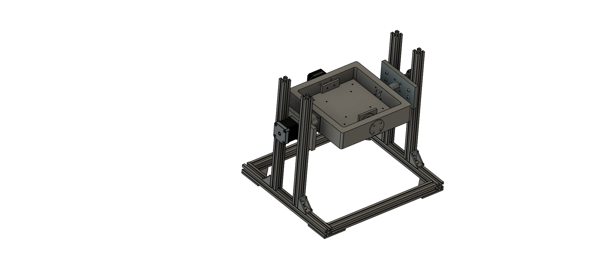

# 3D-Microstat
Open-source 3D Clinostat design inspired by iGEM Concordia. This Clinostat was designed by a team of University of Georgia students for the Small Satellite Research Laboratory to support space biology research and microgravity experiments. This final product occupies very little space compared to most other COTS (Commercial-off-the-Shelf) Clinostats, taking up roughly 350 x 300 x 320 mm of space when fully assembled. Build instructions are included below, though the best assembly help will come from viewing the full Microstat assembly (located in CAD files) and viewing the wiring diagram provided.

**Preface -**

This Clinostat build requires a degree of project-specific tailoring. The 140 x 140 mm payload platform is a hard limit for this form factor without increasing the size of the swingarm. The weight restriction varies by geometry and how far from the platform's surface your payload protrudes. The given platform geometry (STL, CAD file) includes M3 fastener holes that can be used for either designing your own mount to add in addition, OR to temporarily secure your payload to the platform. The given Bill of Materials includes all resources used to build the model you see in the CAD model, and pictures/media. I am sure there are cheaper alternatives available from places such as McMaster-Carr that do not leave much excess hardware. Again, this is just what I used to build this at a decent cost. For any recommendations regarding better part selections, please commit an updated file with the updated part description and links so that we can continuously improve this design. Thanks! 

**Build Instructions -** 

Begin by preparing all of the 3D printed parts required for the Microstat. Once the parts are printed, inspect them for any defects or rough edges and carefully remove any excess material or supports. Assemble the main frame by connecting the printed arm, brackets, and base structure as shown in the CAD assembly image. Make sure all moving parts rotate freely and align properly before tightening any fasteners. The 20.5 mm motor should be mounted to the arm before mounting the arm to the frame. Once the 20.5 mm motor is secured, run its 4 wires into the channel in the arm and out the adjacent side. These wires will exit the main assembly through the long rod towards the slip ring mount. 

Next, mount the larger stepper motor to the main axis bracket using the appropriate screws and ensure it is securely fixed in place. Once both motors are mounted, connect the rotating arm to the main axis so that the two axes of rotation are perpendicular, allowing for true 3D rotation. Adjust any extensions or brackets if needed to minimize friction and wobble. Important note: as seen in the provided media, I added balast to the swingarm opposite the side of the 20.5 mm motor to ensure smooth rotation. If you bought the 10pcs aluminum extrusion package from the BoM, I recommend cutting 100 mm off one of the extras and zip tying the 200 mm segment to the swingarm as shown. Otherwise, you may use anything you have that is near the mass of the 20.5 mm motor.

After the mechanical structure is complete, begin wiring the electronics. Connect each stepper motor to its driver module according to the wiring diagram, double-checking the coil pairs to ensure correct rotation. Attach the driver modules to the Arduino Nano, making sure the power and ground connections are secure. Connect the LCD with the I2C backpack to the designated SDA and SCL pins on the Arduino. Install the push button on a separate small breadboard and attach it to the top of the controller case, in front of the LCD. Once the electronics assembly is complete, lower the breadboard with all connections into the case and close it with the lid on top.

Once the wiring is complete, upload the Arduino code provided in this repository to the Nano. Power up the system and test.
